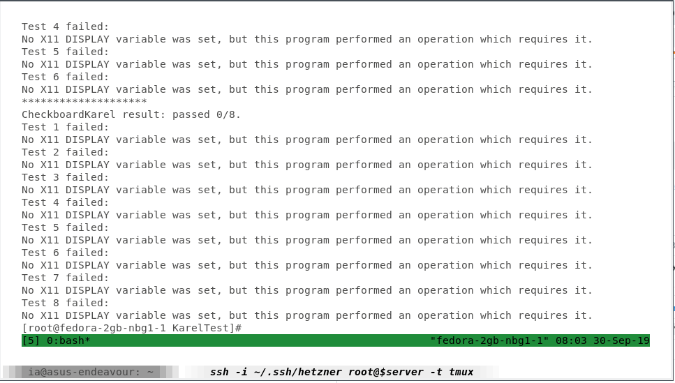
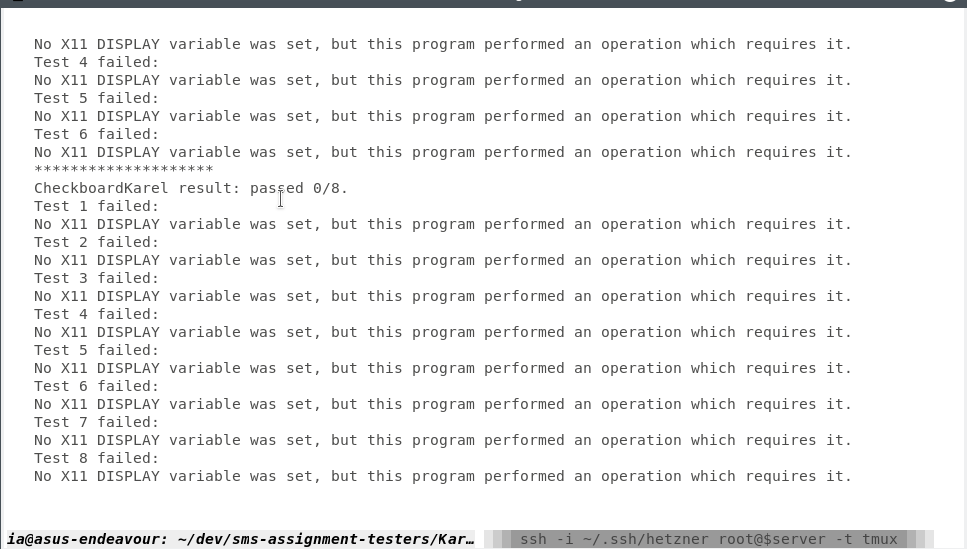
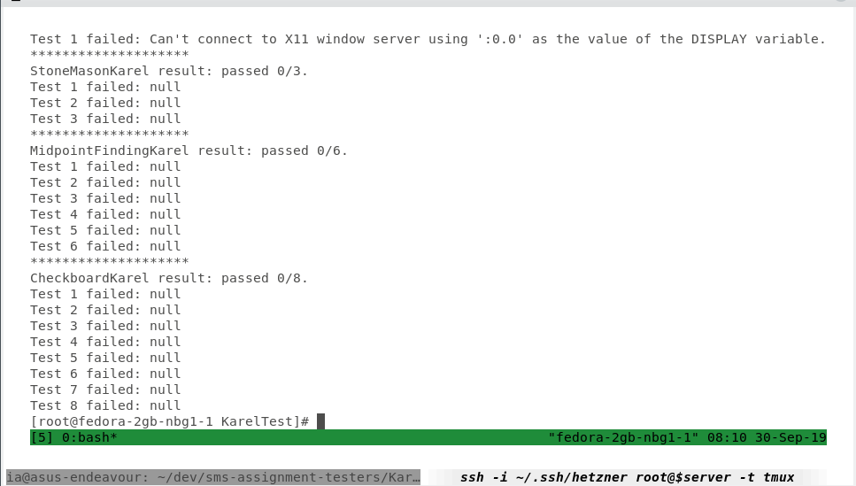

# porting commands to linux
ტესტერები აუცილებელია ლინუქსზე მუშაობდეს ამ შემთხვევებში:
- თუ ლინუქსის სერვერზე იქნება
- დოკერით თუ გაეშვება sms-back (დოკერი ლინუქსია, და commands.bat ვერ
  გაეშვება exec-ით)
- ტესტერები თუ გვინდა ცალკე კონტეინერებად გავუშვათ
## TODO ახლანდელი პროგრესი
### commands.bat გადაკეთება commands.sh

სკრიპტი დავწერე (changecommands.sh), რომელმაც დააკონვერტირა ვინდოუსის ბრძანებები, რამდენიმეზე მუშაობს, ყველას დატესტვა და გასწორება ვერ მოვასწარი. 

### for KarelTest
``` sh
# დაკოპირებების მერე 
cd $1/work
cd Assignment1
javac -cp $1/work/Assignment1/karel.jar:$1/work/Assignment1/junit-4.12.jar:$1/work/Assignment1/hamcrest-core-1.3.jar:$1/work/Assignment1/acm.jar $1/work/Assignment1/CollectNewspaperKarel.java $1/work/Assignment1/StoneMasonKarel.java $1/work/Assignment1/CheckerboardKarel.java $1/work/Assignment1/MidpointFindingKarel.java $1/work/Assignment1/KarelTester.java $1/work/Assignment1/CollectNewspaperKarelTest.java $1/work/Assignment1/StoneMasonKarelTest.java $1/work/Assignment1/CheckerboardKarelTest.java $1/work/Assignment1/MidpointFindingKarelTest.java
java -cp "$1/work/Assignment1:$1/work/Assignment1/karel.jar:$1/work/Assignment1/junit-4.12.jar:$1/work/Assignment1/hamcrest-core-1.3.jar:$1/work/Assignment1/acm.jar" KarelTester 

# გამოძახება
sh commands.sh $(pwd)
```

#### Dockerfiles
პირველი ვერსია, რომელზეც ჯავას ვერსიებზე რაღაც პრობლემა იყო

``` dockerfile
FROM jboss/wildfly
COPY . src/
CMD ["src/commands.sh", "/opt/jboss/src"]
```

``` dockerfile
FROM openjdk:8u181-jdk
COPY . src/
CMD ["src/commands.sh", "/src"]
```
ამაზე დაკომპაილების და classpath პრობლემები არაა, მაგრამ X11ის ერორია (შემდეგი საკითხი)
# x11
კარელის ტესტერებს ჭირდებათ გრაფიკულ დისფლეი სერვერთან კავშირი (x11 ლინუქსზე). ეს
პრობლემა იქნება იმ შემთხვევაში, თუ
## ტესტერი გაეშვება სერვერზე
აზრი არ უნდა ქონდეს ვინდოუსის იქნება თუ ლინუქსის,
  მაგრამ ვინდოუსის სერვერზე არ შემიმოწმებია
output fedora სერვერზე:



## ტესტერი გაეშვება დოკერის კონტეინერში
(მარტო sms-back თუ იყო კონტეინერში, მაინც). იმ შემთხვევაშიც, თუ ეკრანთან კავშირის მქონდე კომპიუტერ
- output დოკერზე (ჩემს ლეპტოპზე)



## TODO რომელ ტესტერებს აქვთ ეს პრობლემა
ყველა, რომელიც კარელს იყენებს, დანარჩენი ბიბლიოთეკები ჯერ არ დამიტესტავს
დავამატებ სტატუსს
## solution
შეიძლება არსებობს ეკრანის და მასთან კავშირის სიმულაციის ბიბლიოთეკები ან ლინუქსის
კონტეინერი, არც ისე კარგად დოკუმენტირებული საკითხია მაგრამ შესაძლებელიუნდა იყოს.
  
### attempts
1. on server
https://stackoverflow.com/questions/662421/no-x11-display-variable-what-does-it-mean
export DISPLAY=:0.0 -ს მერე პროგრამა გაეშვა, მაგრამ



2. with docker
``` sh
docker run -e DISPLAY -v /tmp/.X11-unix:/tmp/.X11-unix iarigby/sms-test
docker run -e DISPLAY=unix$DISPLAY -v /tmp/.X11-unix:/tmp/.X11-unix iarigby/sms-test
```
ორივე იგივე შედეგით სრულდება, როგორც სერვერზე. 

აქედან ვცადე, და ვინოდუსზე დაყენებული დოკერისთვისაც არის მსგავსი ინსტრუქცია 
http://somatorio.org/en/post/running-gui-apps-with-docker/

